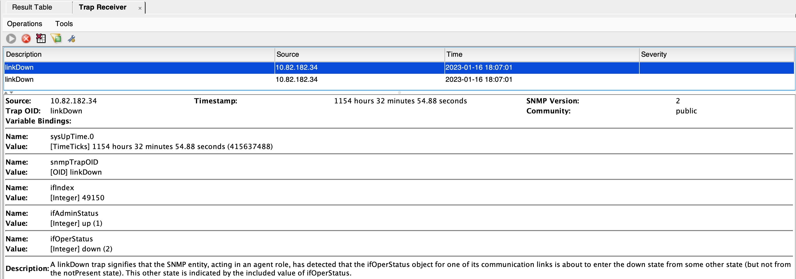
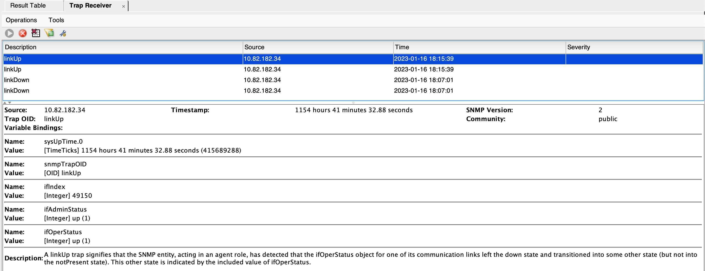

# SR Linux Event-Handler 
# Interface SNMP Trap enablement

This page provides an example of using [SR Linux](https://learn.srlinux.dev/) [event-handler](https://documentation.nokia.com/srlinux/22-11/SR_Linux_Book_Files/Event_Handler_Guide/eh-overview.html) uPython framework to enable SNMP Interface Traps.


For this efect a uPhython and a .bash script are provided:
* [send_trap.sh](scripts/send_trap.sh)
* [snmp-trap-monitor.py](scripts/snmp-trap-monitor.py)


# Installation

Copy both scripts under:
```
/opt/srlinux/eventmgr
```

Grant execution permissions to both files:
````
sudo chmod +x send_trap.sh snmp-trap-monitor.py 
`````

# Configuration

Configure the SR Linux Event Handler, providing the uPython script, the list of SR Linux interfaces to monitor and defintion of the trap target, IP address, community and network-instance:

````
--{ running }--[  ]--
A:leaf1# info system event-handler  
    system {
        event-handler {
            instance monitor_interfaces {
                admin-state enable
                upython-script snmp-trap-monitor.py
                paths [
                    "interface ethernet-1/{1..58} oper-state"
                ]
                options {
                    object network-instance {
                        value mgmt
                    }
                    object snmp-community {
                        value public
                    }
                    object snmp-trap-target {
                        value 10.144.122.122
                    }
                }
            }
        }
    }
````

Verify the state of the Event-Handler execution:

````
A:leaf1# info from state system event-handler instance monitor_interfaces statistics  
    system {
        event-handler {
            instance monitor_interfaces {
                statistics {
                    upython-duration 1
                    execution-count 1
                    execution-successes 1
                }
            }
        }
    }
````

# Test

Bring down a group of interfaces:
````
A:leaf1# interface ethernet-1/{1..2} admin-state disable  
--{ +* candidate shared default }--[  ]--
A:leaf1# commit stay  
All changes have been committed. Starting new transaction.
````

Verify in the SNMP trap-reciver that the LinkDown traps are correctly received:




Bring up a group of interfaces and verify that the SNMP LinkUP traps are correctly received:
````
A:leaf1# interface ethernet-1/{1..2} admin-state enable  
--{ +* candidate shared default }--[  ]--
A:leaf1# commit stay  
All changes have been committed. Starting new transaction.
````



